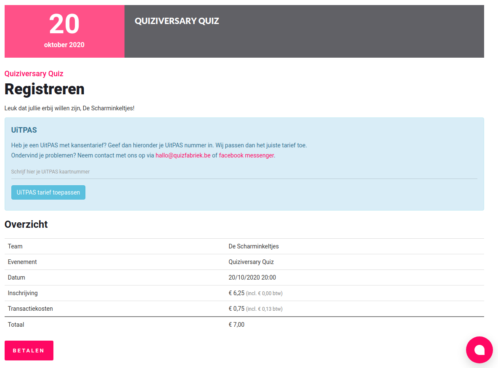
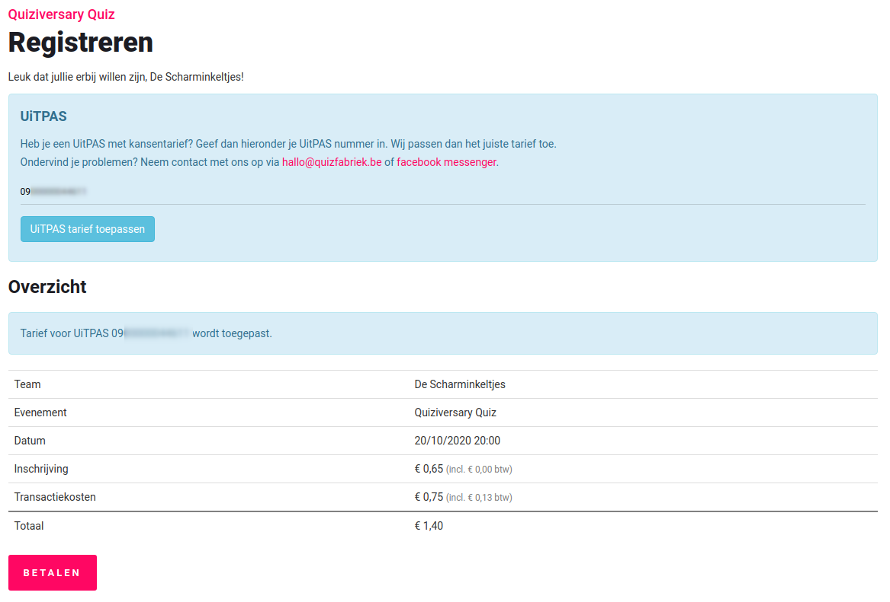

# Catlab Events
CatLab Events is a ticketing system currently aimed towards quizzes, but adaptable to 
any kind of event that requires tickets to be sold. It includes integration with a centralized 
payment gateway and UiTPAS integration (in Belgium).

## Setup
The project relies on some external projects so hosting it is not a straight forward business. You'll have 
to either implement an SSO and payment gateway, or contact us to create accounts on our systems.

Run ```composer install``` to download all required php libraries. Copy ```.env.example``` to ```.env``` and fill in the database
credentials. Finally, run ```php artisan migrate``` to initialize the database.

Run ```npm install``` to install all dependencies and then run ```npm run production``` to compile the resources.

You should now be able to register an account on the website.

### Admin account & organisations
Only admin users can log in into the admin dashboard (at `/admin`). The first user that registers at the fresly installed 
platform will get admin rights assigned automatically.

The platform can host multiple organisations. When an admin user logs in into the admin panel, an organisation is created 
for them, but an admin user can be assigned to multiple organisations.

The admin state of a user is stored in the `admin` property of the `users` table.

### Deploy scripts
There are two buildscripts in /build that you might want to use to deploy on production servers.

We run ```prepare.sh``` on our buildserver, then push the whole project over sftp and finally run ```upgrade.sh``` on 
the production server. There are cleaner ways to handle deploys, so feel free to use your own system.

## UiTDatabank
This project integrates with the [UiTPAS API](https://documentatie.uitdatabank.be/) to sell 
discounted/subsidised tickets for verified organisations. The integration does not include synchronizing 
events with the uitdatabank just yet, so uitdatabank ids must be manually set in the event admin panel.





A sale of an UiTPAS subsidised ticket follows a few steps:
1. Before the sale, a client is requested to enter their UiTPAS id in a text field. Once submitted, a call is made to 
[`uitpas/cultureevent/search`](https://documentatie.uitdatabank.be/content/uitpas_api/latest/events/uitpas-aanbod-doorzoeken.html) 
to fetch the applicable tariff for this specific user. This call happens in [UiTPASVerifier](app/UitDB/UiTPASVerifier.php).
Once the appropriate tariff is fetched, it is entered in the [TicketPriceCalculator](app/Tools/TicketPriceCalculator.php) 
where the tariff is split into ticket sale, transaction costs and VAT, depending on the settings of the event 
(include / exclude ticket fee from the tariff).
3. The user then has a chance to validate their purchase.
4. When they confirm their sale, we first create a new [Order](app/Models/Order.php), save it, then register the sale 
to UiTPAS (this can only be done once) by calling [`uitpas/cultureevent/{eventCdbid}/buyonline/{uitpasNumber}`](https://documentatie.uitdatabank.be/content/uitpas_api/latest/events/online-registratie-van-verkoop-van-ticket.html) 
and then redirect the user to the payment gateway. The registration happens in registerTicketSale in 
[UiTPASVerifier](app/UitDB/UiTPASVerifier.php). We store the UiTPAS sale id in the Order model.
5. If the payment succeeds, we are done. 
6. If the payment does not succeed, we need to cancel the order to make sure the user can try again and the UiTPAS sale 
won't block the transaction. We call [`uitpas/cultureevent/cancelonline/{ticketSaleId}`](https://documentatie.uitdatabank.be/content/uitpas_api/latest/events/online-annulatie-van-verkoop-van-ticket-adhv-id.html) 
This is done in registerOrderCancel in [UiTPASVerifier](app/UitDB/UiTPASVerifier.php).

## Domains
events.catlab.eu
live.quizfabriek.be
live.huiskamerquiz.be
tickets.quizfabriek.be
live.quizwitz.com
live.sittingbull.be
quiz.gent
www.quiz.gent